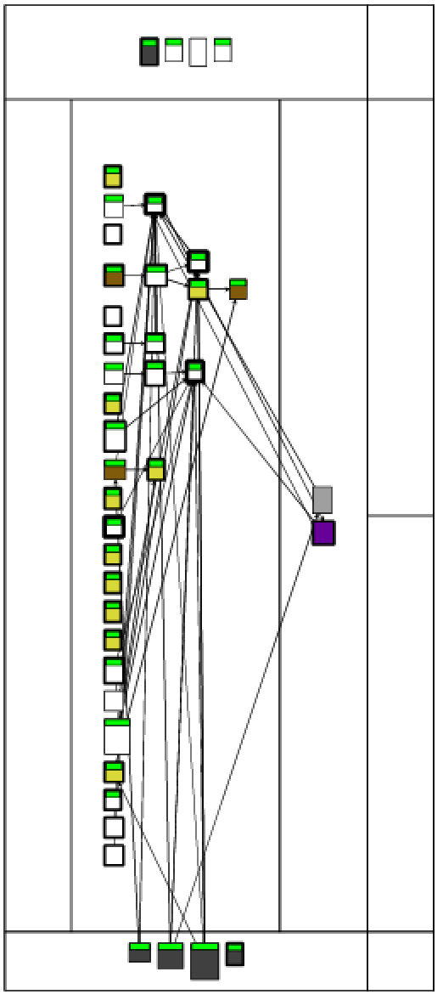
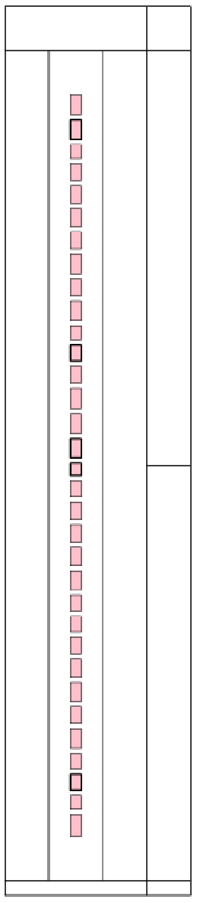
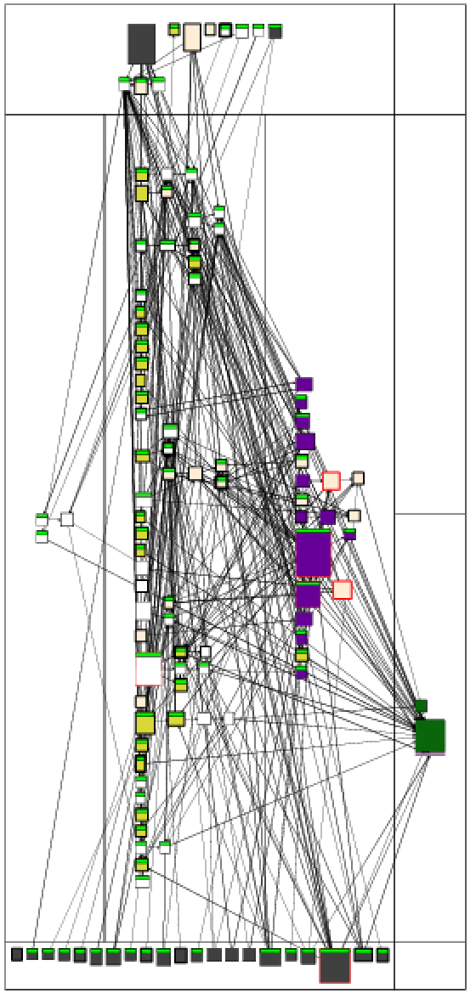
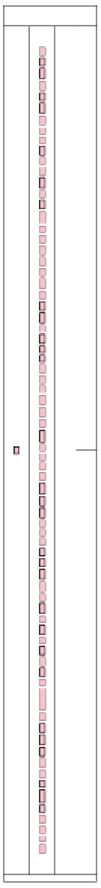
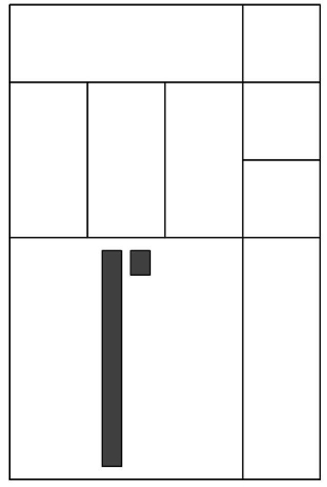
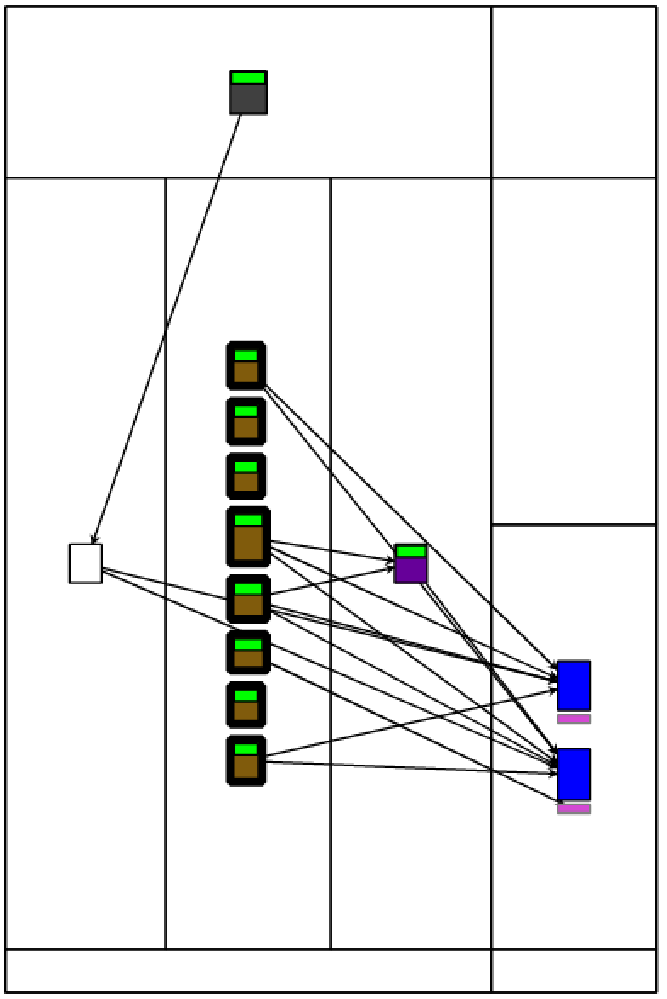
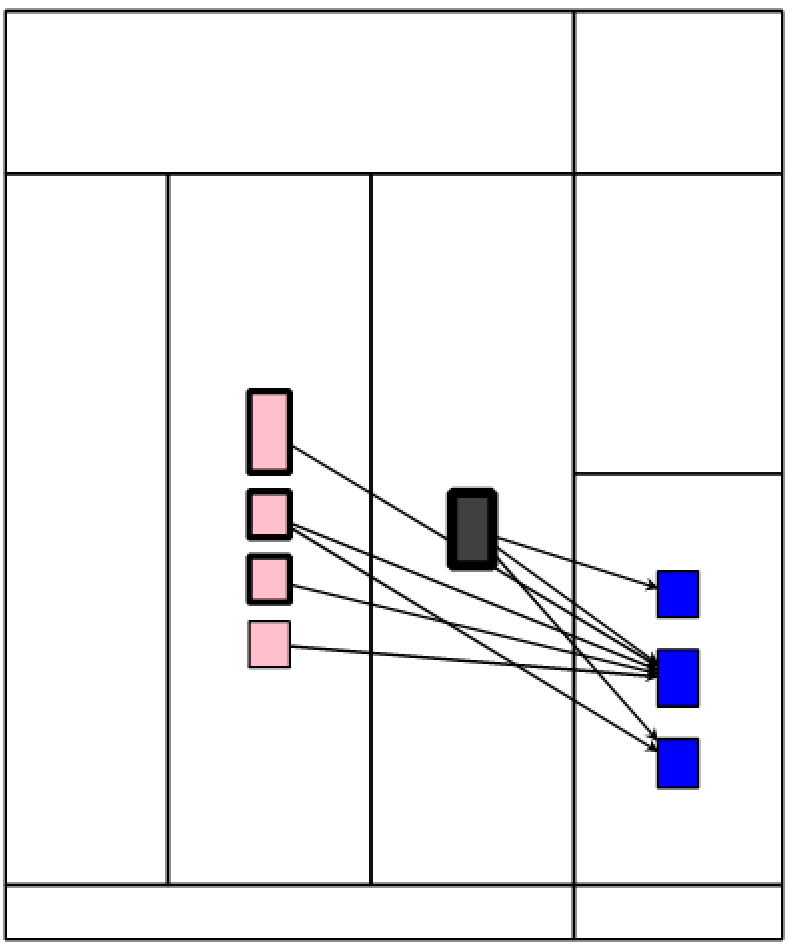
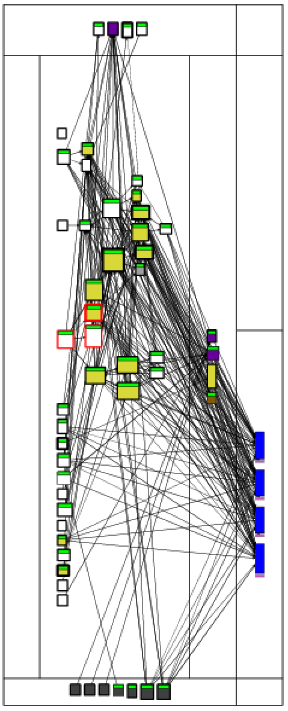

# Observations on PolyMath

## How to Install

```st
Metacello new
    repository: 'github://PolyMathOrg/PolyMath';
    baseline: 'PolyMath';
    load.
```

## PMVector



- Most methods are tested, except the following ones:
	- **External:** adaptToComplex:andSend:, adaptToQuaternion:andSend:, accumulateNegated:, productWithMatrix:, and scaleBy:
	- **Internal:** checkDimensionalCompatibility: and productWithVector:
	- **Class side:** randomSize:maxNumber:

- False positive: PMVector>>checkDimensionalCompatibility: is grey, so it should be a constant method. But it is not. It is a boolean method that returns true in its last statement.
- False positive: None of the dead methods in this class are actually dead. They are just part of API, not used by PolyMath but meant to be used by its clients.

## PMVectorTest



- As expected, all methods are tests
- False positive (maybe): some methods are marked as polymorphic, but they are just methods wit common names. E.g., testAsArray. I am not sure if test methods can be polymorphic... Perhaps, this is only because of the naming convention that we use in Pharo: asArray is polymorphic -- it is a common name and every class that implements it can be converted to an array - that's the polymorphic behavior. But testAsArray is not supposed to be called, it's only named this way because it tests the asArray method. If I rename it to test1, nothing will change.

## PMMatrix



- There are two large methods qrFactorization and qrFactorizationWithPivoting which should not even be in PMMatrix. I would move them to a separate package. And then refactor them to make them smaller
- choleskyDecomposition is another big method that should be moved to a separate package and refactored
- PMMatrix>>split has a red border, so I guess this means that it has high cyclomatic complexity. But it has no if statements. Only Array with: with with: and several collect: loops.
- adaptToNumber:andSend: is not a dead method. It is a hook that is widely used by Pharo collections. This is another example of false positives for dead methods: abstract hooks.
- example method is too big and shows too many things at a time. Perhaps, we could split it into several example methods.
- Many methods are not tested. Some of those tests are important. For example eigen (terrible name), join:, rowsCollect:, columnsCollect:

## PMMatrixTest



- All good, many tests

## BaselineOfPolyMath



- baseline is one huuuge method. Perhaps, we should split it into multiple smaller ones.

## PMMultivariateNormalDistribution



- Almost all methods are marked as megamorphic. Why? Because there are many distribution classes and they all have the same API. Take a look at kurtosis for example. It is implemented by all distribution classes. But I am not sure if this is enough to call a method megamorphic. This is a just a typical case of a polymorphic method. A megamorphic method could be printOn: for example or asString -- methods that are implemented by hundreds of different classes from different projects that don't even share a common superclass (except Object).
- Everything is tested except the initialize method (of course it is... because I wrote this class :D )

## PMMultivariateNormalDistributionTest



- All good here: four test methods, one setUp, three attributes
- setUp is megamorphic... meh... maybe... to me it just seems like a normal inheritance with a polymorphic method

## PMQuaternion



- this is some big class that I don't understand
- it has some bad method names like j and k
- and bad attribute names: qi, qj, qk, qr
- I am not sure if guard closes should be considered when calculating cyclomatic complexity. I mean yes, they affect the number of branches but this is not something very interesting on a visualization. Because many methods just have 2-3 ifTrue: expressions at the beginning to check the conditions and raise exception. Does it make the method complex? Should the complexity be reduced? No, it's a good practice.